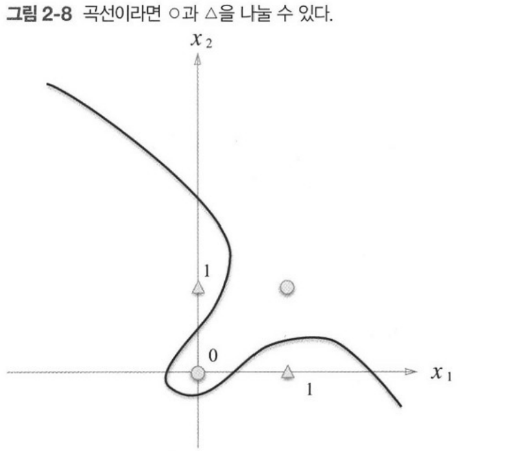
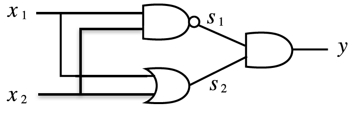

## 2.1 퍼셉트론이란?

- 퍼셉트론은 다수의 신호를 입력받아 하나의 신호로 출력한다.
- 신호를 보낼 때 입력 신호에 가중치가 곱해지는데, 신호의 총합이 한계(임계점)을 넘어설 때만 1을 출력한다.
- 따라서 퍼셉트론은 1이나 0 두 가지의 값만 가질 수 있다.
- 가중치는 각 신호가 결과에 주는 영향력을 조절하는 요소로, 클수록 신호가 그만큼 더 중요함을 의미한다.
  - 전류에서 말하는 저항과 같은 개념으로 작용하는 방향을 반대이지만 신호가 얼마나 잘 흐르는가를 통제한다는 점에서 같은 기능을 한다.

### 수식

y = 1 (if w1x1 + w2x2 > θ)
y = 0 (otherwise)

## 2.2 단순한 논리회로

### 2.2.1 AND 게이트

- AND 게이트는 두 입력이 모두 1일 때만 1을 출력하고, 그 외에는 0을 출력한다.
- 이 AND 게이트를 퍼셉트론으로 표현하고 싶다면 어떻게 해야 할까?
  - 두 입력에 곱해지는 각각의 가중치 값을 설정해야 하고, 출력값이 1인지 0인지를 결정하는 임계값을 설정해야 한다.
- 즉 AND 게이트의 진리표 값을 만족하는 매개변수 조합이 따로 있는데, (0.5,0.5,0.8), (1.0,1.0,1.0) 등 많은 경우의 수가 존재한다.
  - 예를들어 (0.5, 0.5, 0.8) 인 경우
    - 진리표의 조합이 입력이 모두 0이고 출력이 0일 때, 0x0.5+0x0.5=0으로 임계값인 0.8보다 작으므로 출력값이 0으로 만족하고,
    - 입력 하나만 1이고 출력이 0일 때, 1x0.5+0x0.5=0.5 <= 0.8 이므로 출력값은 0으로 만족,
    - 입력이 모두 1이고 출력이 1일 때, 1x0.5+1x0.5 > 0.8 이므로 출력값은 1으로 만족한다.
  - 다만 이렇게 매개변수를 정하는 경우에 입력값과 가중치의 곱들의 합이 "임계점보다 작거나 같은 경우"에 출력이 0이기 때문에
    임계점과 같은 경우에는 출력이 0인 점을 주의해야할 것 같다.

### 2.2.2 NAND 게이트와 OR 게이트

- NAND 게이트
  - NAND 게이트는 Not AND 게이트로 AND 게이트와 반대되는 값을 출력한다.
  - 입력값이 모두 1일때만 0을 출력하고 그 외에는 1을 출력한다.
  - 마찬가지로 매개변수 조합은 (-0.5, -0.5, -0.7)와 같은 조합이 있는데 "AND 게이트를 구현하는 매개변수 부호를 모두 반전하기만 하면 된다"
- OR 게이트
  - 입력 신호 중 하나 이상이 1이면 출력이 1이 되는 논리 회로이다.
  - 이 OR 게이트의 매개변수는 어떻게 설정하면 될까?
    - 생각해본 결과 각 가중치는 입력이 0인 경우를 제외하면 모두 임계점을 넘을 정도의 값을 가져야 하므로, 모든 가중치의 값이 임계점의 값보다 크게 매개변수 조합을 설정해야 한다. 예를 들면 (0.6,0.6,0.5) 와 같은 조합이 가능하다. 다만 (0.5,0.5,0.5)와 같이 같은 값은 출력이 0으로 처리되므로 이 조합은 불가능하다.

- note
  - 여기서 퍼셉트론의 매개변수의 값은 인간이 결정하고, 머신러닝 문제는 매개변수의 값을 정하는 작업을 컴퓨터가 자동으로 하도록 한다.
    -> 학습이란 적절한 매개변수 값을 정하는 작업이며, 사람은 퍼셉트론의 구조를 고민하고 컴퓨터에 학습할 데이터를 주는 일을 한다.

## 2.3 퍼셉트론 구현하기

### 2.3.1 간단한 구현

```python
def AND(x1, x2):
    w1,w2,theta = 0.5, 0.5, 0.7
    tmp = x1*w1+x2*w2
    if tmp <= theta:
        return 0
    elif tmp > theta:
        return 1
```

- 매개변수를 함수 안에서 초기화하고, 입력 총합이 임계값을 넘으면 1, 그렇지 않으면 0 출력

### 2.3.2 가중치와 편향 도입

- 이전에 사용한 임계값인 theta를 -b로 치환하여 아래와 같이 식을 만든다.
  y = 1 (if b + w1x1 + w2x2 > 0)
  y = 0 (otherwise)
- 여기서 도입한 b를 편향이라고 하며 퍼셉트론은 입력신호에 가중치를 곱한 값과 편향을 합하여 그 값이 0을 넘으면 1을 출력하고, 그렇지 않으면 0을 출력하는 것이다.

### 2.3.3 가중치와 편향 구현하기

```python
import numpy as np
def AND(x1,x2):
    x=np.array([x1,x2])
    w=np.array([0.5,0.5])
    b=-0.7
    tmp = np.sum(w*x)+b
    if tmp<=0:
        return 0
    else:
        return 1
```

- 가중치와 편향을 도입한 AND게이트 이다.
- 가중치는 각 입력 신호가 결과에 주는 영향력(중요도)를 조절하는 매개변수 이고, 편향의 값은 뉴런이 얼마나 쉽게 활성화되는 지를 결정한다.
- 나머지 NAND와 OR 게이트 모두 같은 구조의 퍼셉트론이므로 코드의 구조는 같지만 가중치(w와 b)만 다르다는 것을 알 수 있다.

## 2.4 퍼셉트론의 한계

### XOR 게이트, 선형과 비선형

- XOR 게이트는 배타적 논리합이라는 논리 회로이다. 두 입력값 중 한쪽이 1일때만 1을 출력한다.
- 지금까지 구현한 퍼셉트론으로는 XOR 게이트를 구현할 수 없다.
  

- OR 게이트의 경우에는 그래프로 보았을 때 0과 1 출력 결과에 따라 직선으로 나뉜 두 영역을 만들 수 있으나 XOR의 경우 직선으로 나누는 것이 불가능하다.
- 곡선으로 나눈다면 위의 그림과 같이 영역을 나눌 수 있으며 이와 같은 영역을 "비선형 영역", 직선의 영역은 "선형 영역"이라고 한다.

## 2.5 다층 퍼셉트론이 출동한다면

- 퍼셉트론으로는 XOR게이트를 표현할 수 없다. 즉 단층 퍼셉트론으로는 비선형 영역을 분리할 수 없다. 하지만 퍼셉트론은 층을 쌓아 "다층 퍼셉트론"을 만들 수 있다.

### 2.5.1 기존 게이트 조합하기

- 다음과 같이 조합한다면 XOR 게이트를 구현할 수 있다.
  
- NAND, OR 게이트에 입력이 되고 이의 출력이 AND게이트의 입력이 된다.

### 2.5.2 XOR 게이트 구현

```python
def XOR(x1,x2):
    s1= NAND(x1,x2)
    s2= OR(x1,x2)
    y=AND(s1,s2)
    return y
```

- 다음과 같이 코드로 구현할 수 있으며 다른 퍼셉트론과 달리 XOR은 다층퍼셉트론이라고 한다.
- 이를 0층, 1층, 2층으로 구성된 것으로 표현할 수 있으며, 0층의 뉴런이 입력을 받아 1층 뉴런으로 신호를 보내고, 1층 뉴런이 2층으로 신호를 보내고 2층 뉴런이 y를 출력하는 방식이다.
- 이렇게 해서 2층 구조를 이용해 XOR 게이트를 구현할 수 있고,
  -> 단층 퍼셉트론으로는 표현하지 못한 것을 층을 하나 늘려서 구현할 수 있다. => 퍼셉트론은 층을 쌓아(깊게 하여) 더 다양한 대상을 표현할 수 있다.

## 2.6 NAND에서 컴퓨터까지

- 다층 퍼셉트론은 이론상으로 컴퓨터를 구현할 수 있다
- 다층 퍼셉트론은 더욱 복잡한 회로를 구성할 수 있는데 가산기, 인코더 에서 컴퓨터까지 표현할 수 있다. 이는 컴퓨터도 퍼셉트론과 같은 방식으로 계산을 수행한다는 의미가 된다.
- NAND 게이트만으로 컴퓨터를 만들 수 있으며 이론상 2층 퍼셉트론이면 컴퓨터를 만들 수 있다. (비선형인 시그모이드 함수를 활성화 함수로 이용)
