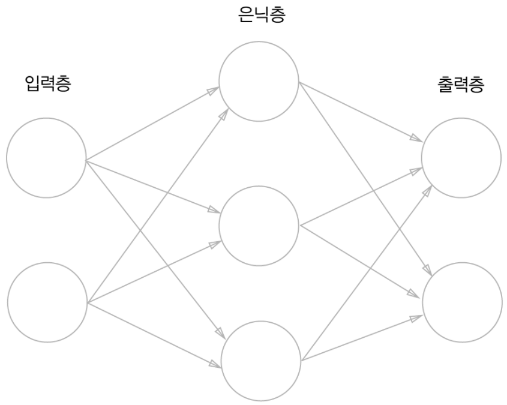
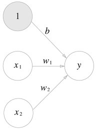
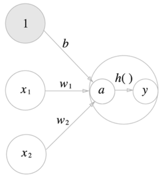
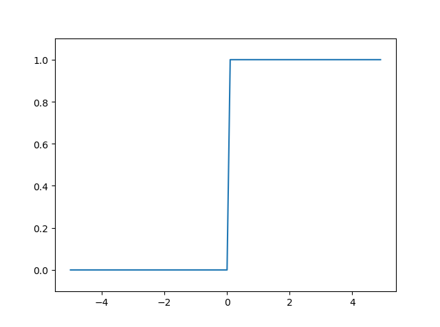
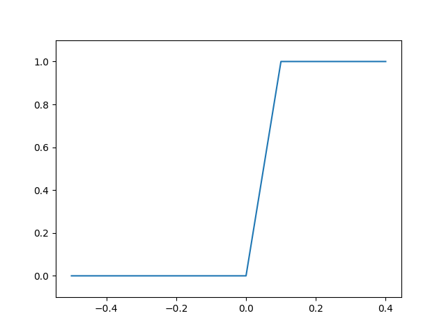
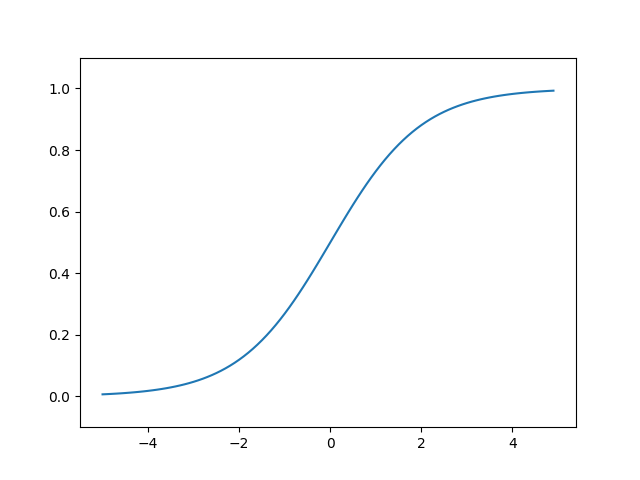
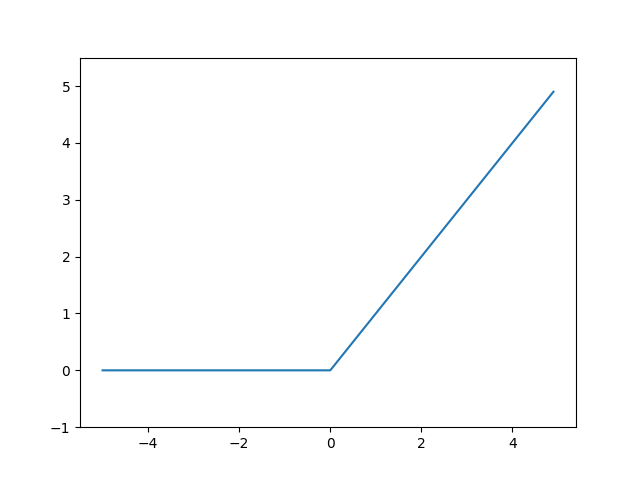

## 개요

- 퍼셉트론을 표현할 때 가중치를 설정하는 작업은 사람이 수동으로 한다.
- 하지만 신경망은 가중치 매개변수의 적절한 값을 데이터로부터 자동으로 학습하는 능력을 갖추고 있으며, 3장에서는 신경망이 입력 데이터가 무엇인지 식별하는 처리 과정을 다룬다.

## 3.1 퍼셉트론에서 신경망으로

### 3.1.1 신경망의 예



- 신경망을 그림으로 나타낸 것이고, 가장 왼쪽 줄을 입력층, 맨 오른쪽 줄을 출력층, 중간 줄을 은닉층이라고 한다.
- 0층이 입력층, 1층이 은닉층, 2층이 출력층이다.
- 신경망은 모두 3층이나 가중치를 갖는 층은 2개뿐이기 때문에 2층 신경망이라고 한다.

### 3.1.2 퍼셉트론 복습

- 퍼셉트론은 입력에서 가중치가 곱해진 값을 출력하는 형태로 나타내었으나 편향을 명시한다면 다음 그림과 같이 나타낼 수 있다.
  
- 가중치가 b이고 입력이 1인 뉴런이 추가된 것이다.
- 조건 분기의 동작을 하나의 식으로 나타내보자.
  - 퍼셉트론에서 h(x)는 입력값이 0보다 크면 1, 그렇지 않으면 0을 출력하는 함수라고 하면, 퍼셉트론은 다음과 같이 표현된다.
  - y= h(w1x1 + w2x2 +b)
  - 여기서 h(x)는 조건문을 수학적으로 표현한 활성화 함수라고 한다.

### 3.1.3 활성화 함수의 등장

- _활성화함수_ : 방금 나온 것 처럼 입력 신호의 총합을 출력신호로 변환하는 함수를 일컫는다. 입력신호의 총합이 활성화를 일으키는지를 정하는 역할을 한다.

- 식을 다시 써보면
  - a = b + w1x1 + w2x2
  - y = h(a)

- 가중치가 달린 입력 신호와 편향의 총합을 계산한 것을 a라고 하고 이를 h()에 넣어 y를 출력하는 흐름이다.
  
- 가중치 신호를 조합한 결과가 a라는 노드가 되며 활성화 함수를 통과 하며 출력인 y노드로 변환되는 과정이 나타나 있다.

## 3.2 활성화 함수

- 방금 본 함수와 같이 임곗값을 경계로 출력이 바뀌는 함수를 *계단 함수*라고 한다.
- 따라서 '퍼셉트론에서는 여러 활성화 함수 중에 계단 함수를 이용한다'고 할 수 있으며 계단 함수 이외에도 다른 활성화 함수들이 존재한다.

### 3.2.1 시그모이드 함수

- 신경망에서는 활성화 함수로 시그모이드 함수를 이용하여 신호를 변환하고 변환된 신호를 다음 뉴런에 전달한다.

### 수식

h(x) = 1 / (1 + e^(-x))

- 여기서 e^(-x) 는 exp(-x)로도 표현할 수 있다.
- 퍼셉트론과 신경망의 주된 차이는 활성화 함수로 어떤 함수를 이용하느냐 이고, 그 외의 뉴런의 구조와 신호를 전달하는 방법은 동일하다.

### 3.2.2 계단 함수 구현하기

```python
def step_function(x):
    if x>0:
        return 1
    else:
        return 0
```

- 위의 구현은 단순하고 쉽지만, 인수는 실수만 받아들이며 넘파이 배열을 인수로 넣을 수 없는 문제가 발생한다. 따라서 넘파이 배열도 지원하도록 수정하면 다음과 같다.

```python
def step_function(x):
    y = x > 0
    return y.astype(int)
```

- 위의 구현은 넘파이의 편리한 트릭을 사용한 덕분이다
- 만약 x에 배열 x=np.array([-1.0,1.0,2.0])을 할당하고, 부등호 연산을 수행한다면 원소 각각에 부등호 연산을 수행한 bool배열이 생성된다.
  - 즉 위의 배열의 경우에는 array([False, True, True]) 라는 새로운 y 배열이 생성된다.
  - 하지만 우리가 원하는 계단함수는 0이나 1의 int형을 출력하는 함수이기 때문에 이와 같은 원소를 bool에서 int형으로 바꿀 수 있다.
  - 이때 사용되는 메서드가 astype()이며 넘파이 배열의 자료형을 변환할 때 이용한다. (파이썬에서 bool을 int로 변환하면 True는 1로 False는 0으로 변환된다.)

### 3.2.3 계단 함수의 그래프

```python
import numpy as np
import matplotlib.pylab as plt

def step_function(x):
    return np.array(x>0, dtype=int)

x= np.arange(-5.0,5.0,0.1)
y= step_function(x)
plt.plot(x,y)    #x,y를 좌표로 그래프를 그린다.
plt.ylim(-0.1,1.1)  #y축의 그래프의 보이는 범위를 지정
plt.show()
```

- np.arange(-5.0,5.0,0.1)은 -5.0에서 5.0전까지 0.1 간격의 넘파이 배열을 생성한다.
- step_function()은 인수로 받은 넘파이 배열의 원소 각각을 인수로 받아 계단 함수를 실행하고 결과를 다시 배열로 돌려준다.
  
- 다음과 같이 그래프가 그려지는 것을 알 수 있다.

- 하지만 코드를 직접 실험해 본 결과 범위의 값을 좁게 할수록 그래프의 계단이 살짝 기울여서 출력되는 것을 알 수 있다. 여기서 실제 값에는 계단함수의 기능이 온전히 작용하지만 그래프 상에서는 점이 적기 때문에 시각적 착시가 일어난 것이다. 계단함수의 그래프의 기울기가 항상 0이라는 점에는 변함이 없다.
  
  - 이 그래프는 범위를 -0.5~0.5로 잡고 step을 0.1로 잡았을 때의 결과이다.
  - 이 그래프를 통해 계단 함수의 급격한 변화의 특성을 알 수 있다.

### 3.2.4 시그모이드 함수 구현하기

- 시그모이드 함수는 파이썬으로 다음과 같이 작성한다.

```python
def sigmoid(x):
    return 1/(1+np.exp(-x))
```

- 이 경우에 인수가 넘파이 배열이여도 올바른 결과가 출력된다.
- 넘파이 배열은 단순한 수치 연산을 할 경우에도 스칼라 값과 넘파이 배열 각 원소 사이에 연산이 이루어진다.
  - 따라서 시그모이드 함수에서도 np.exp(-x)가 넘파이 배열을 반환하기 때문에 결과적인 시그모이드 함수도 배열의 각 원소에 연산을 수행한 결과를 내어준다.



### 3.2.5 시그모이드 함수와 계단 함수 비교

- 시그모이드 함수와 계단함수의 가장 특징적인 차이는 '매끄러움'의 차이이다.
- 계단 함수는 0과 1 중 하나의 값만 돌려주는 반명 시그모이드 함수는 실수를 돌려준다는 점도 다르다.
  - 즉 퍼셉트론에서는 뉴런 사이에 0 혹은 1이 흘렀다면, 신경망에는 연속적인 실수가 흐르는 것이다.
- 공통점에는 큰 관점에서 보았을 때 둘은 입력이 작을 때의 출력은 0에 가깝고(혹은 0이고) 입력이 커지면 출력이 1에 가까워지는(혹은 1이 되는) 구조라는 점이다.
  - 또한 입력이 아무리 작거나 크더라도 출력은 0과 1사이라는 점도 공통점이다.

### 3.2.6 비선형 함수

- 계단 함수와 시그모이드 함수의 또다른 공통점으로는 모두 *비선형 함수*라는 점에 있다.
  - 여기서 비선형 함수는 선형 함수가 1개의 직선이 되는 것과는 다른 문자 그대로 '선형이 아닌' 함수로 직선 1개로는 그릴 수 없는 함수를 말한다.
- 신경망에서는 활성화 함수로 비선형 함수를 사용해야만 하며, 선형 함수를 이용하면 안된다.
  - 왜 선형 함수를 사용하면 안될까?
    - 선형 함수는 층을 아무리 깊게 해도 의미가 없다. 즉 은닉층이 없는 네트워크와 똑같은 기능을하게 된다.
    - 가령 h(x)인 활성화 함수를 cx인 선형함수로 두었다고 하자. 그렇다면 층을 더 깊게 한다는 의미는 h(h(h(x)))와 같이 3층 네트워크를 만드는 것이 예시가 될 수 있겠다. 그렇다면 이 함수는 곱셈을 하기는 하지만 결국에는 ax와 같이 같은 식을 의미하게 된다.
    - 따라서 선형 함수로는 여러 층으로 구성하는 이점을 살릴 수 없으므로 활성화 함수로는 반드시 비선형 함수를 사용한다.

  -Q: 그렇다면 계단 함수는 비선형 함수인 것일까? -> 마찬가지로 직선 하나로 표현할 수 없는 불연속 함수이므로 비선형 함수이다.
  - 또한 위의 선형함수의 예시처럼 h(h(h(x)))를 만든다고 하자. 그렇게 된다면 각 층에서 데이터를 나누고 결과를 다시 조합하는 과정을 반복한다. 이는 앞서 2장에서 살펴본 XOR 게이트를 NAND,AND,OR 게이트를 조합하여 구현한 것과 마찬가지의 결과로 선형 함수와는 다르게 입력 데이터를 계속해서 다른 형태로 바꾸므로 비선형 함수라는 사실을 알 수 있다.

### 3.2.7 ReLU 함수

- 시그모이드 함수는 신경망 분야에서 오래전부터 이용해왔으나, 최근에는 ReLU(렐루) 함수를 주로 이용한다.
  
- ReLU는 입력이 0을 넘으면 그 입력을 그대로 출력하고, 0 이하이면 0을 출력하는 함수이다.

###수식

h(x)=x (if x>0)
h(x)=0 (if x<=0)

```python
def relu(x):
    return np.maximum(0,x)
```
