## 개요

- 이번 장의 주제는 신경망 학습으로 여기서 학습이란 훈련 데이터로부터 가중치 매개변수의 최적값을 자동으로 획득하는 것이다.
- 신경망이 학습할 수 있도록 해주는 지표인 손실 함수를 소개하고, 이 결괏값을 가장 작게 만드는 가중치 매개변수를 찾는 것이 목표이다.
- 손실 함수의 값을 작게 만드는, 함수의 기울기를 활용하는 경사법을 소개한다.

## 4.1 데이터에서 학습한다!

- 데이터에서 학습한다는 것은 가중치 매개변수의 값을 데이터를 보고 자동으로 결정한다는 뜻이다.
- 실제로 신경망에서 매개변수는 수천 수만 개, 수억 개 이상이기 때문에 매개변수를 수작업으로 정하는 것은 불가능하다.
- 따라서 신경망 학습은 데이터로부터 매개변수의 값을 정하는 방법이고, 이번 장에서는 이에 대해 배우게 된다.

### 4.1.1 데이터 주도 학습

- 머신러닝의 중심에는 데이터가 존재한다. 데이터가 이끄는 접근 방식 덕분에 사람 중심 접근에서 벗어날 수 있다.
- 머신러닝은 사람의 개입을 최소화하고 수집한 데이터로부터 패턴을 찾으려 시도한다. 게다가 신경망과 딥러닝은 기존 머신러닝에서 사용하던 방법보다 사람의 개입을 더욱 배제할 수 있게 해준다.

- 인간이 인식할 수 있는 사소한 문제와 같은 것도 그 안에 숨은 규칙을 명확한 로직으로 풀기는 쉽지않다.
- 그렇기 때문에 알고리즘을 밑바닥부터 설계하는 대신, 주어진 데이터를 활용해 해결할 수 있다.
- 이미지에서 특징을 추출하고 그 특징의 패턴을 머신러닝 기술로 학습하는 방법이 그 중 하나이다.
  - 특징 : 입력 데이터에서 본질적인 데이터를 정확하게 추출할 수 있도록 설계된 변환기
    - 이미지의 특징은 보통 벡터로 기술하고 컴퓨터 비전 분야에서 SIFT, SURF, HOG등의 특징을 많이 사용한다.
  - 이러한 특징을 사용하여 이미지 데이터를 벡터로 변환하고 변환된 벡터를 가지고 SVM,KNN(지도 학습의 대표 분류 기법)으로 학습한다.

- 이와 같이 머신러닝에서 모아진 데이터로부터 규칙을 찾아내는 역할은 '기계'가 담당한다.
- 다만 이미지를 벡터로 변환할 때 사용하는 특징은 여전히 '사람'이 설계한다.
  - 이 말은 문제에 적합한 특징을 쓰지 않으면 좀처럼 좋은 결과를 얻을 수 없다는 뜻이다.
- 즉, 특징과 머신러닝을 활용한 접근에도 문제에 따라서는 '사람'이 적절한 특징을 생각해내야 한다.

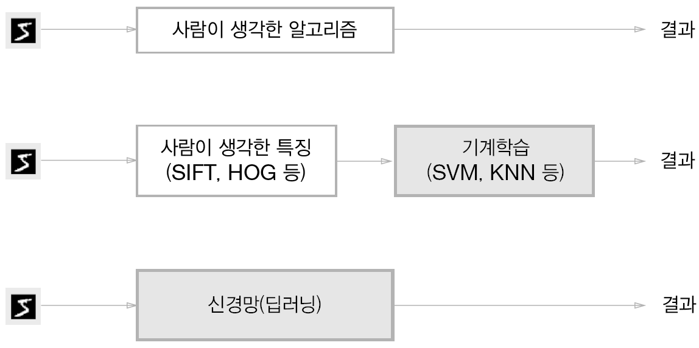

- 위와 같이 신경망은 이미지를 있는 그대로 학습한다. 특징과 머신러닝 방식에서는 특징을 사람이 설계했지만, 신경망은 이미지에 포함된 중요한 특징까지도 '기계'가 스스로 학습할 것이다.
- 신경망은 모든 문제를 같은 맥락에서 풀 수 있다. 세부사항과 관계없이 주어진 데이터를 온전히 학습하여 문제의 패턴을 발견하려 시도한다.
- 즉 신경망은 모든 문제를 주어진 데이터 그대로 입력 데이터로 활용해 처음부터 끝까지 사람의 개입없이 결과를 얻는다. 따라서 종단간 머신러닝이라고도 한다.

### 4.1.2 훈련 데이터와 시험 데이터

- 머신러닝 문제는 데이터를 훈련 데이터와 시험 데이터로 나눠 학습과 실험을 수행하는 것이 일반적이다.
  - 훈련 데이터만 사용하여 학습하면서 최적의 매개변수를 찾은 뒤 시험 데이터를 사용하려 훈련한 모델의 실력을 평가한다.
- 우리가 원하는 것은 범용적으로 사용할 수 있는 모델이기 때문에 범용 능력을 제대로 평가하기 위해 훈련 데이터와 시험 데이터를 분리하는 것이다.

- 범용 능력 : 훈련 데이터에 포함되지 않는 데이터로도 문제를 올바르게 풀어내는 능력이자 머신러닝의 최종 목표
  - 특정 데이터만 잘 판별하면 그 데이터에 포함된 것만 학습했을 가능성이 높아 범용 능력이 떨어진다고 본다.
- 그렇기 때문에 데이터셋 하나로만 매개변수의 학습과 평가를 수행한다면 올바른 평가가 될 수 없다.
  - 한 데이터셋에만 지나치게 최적화된 상태를 '과대적합'이라고 한다.

## 4.2 손실 함수

- 신경망은 '하나의 지표'를 기준으로 최적의 매개변수 값을 탐색하는데 신경망 학습에서 사용하는 지표는 '손실 함수'라고 한다.
- 이 손실함수는 임의의 함수를 사용할 수도 있지만 일반적으로 오차제곱합과 교차 엔트로피 오차를 사용한다.

### 4.2.1 오차제곱합

- 가장 많이 쓰이는 손실 함수는 오차제곱합이다.
  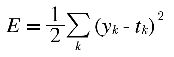
- y는 신경망의 출력(추정한 값), t는 정답레이블, k는 데이터의 차원 수를 나타낸다.
- y와 t는 원소 n개짜리 데이터를 나타내는데 y는 각각의 데이터를 정답이라고 예측한 확률을 나타내며, t는 정답 레이블이기 때문에 한 원소만 1로 하고 그 외는 0으로 나타내는 원-핫 인코딩으로 나타낸다.

```python
def sum_squares_error(y,t):
  return 0.5*np.sum((y-t)**2)

```

- 실제로 배열을 입력하면 정답일 확률을 가장 높게 추정한 배열을 y에 입력했을 때 결과값인 오차가 작게 나오는 것을 알 수 있다.

### 4.2.2 교차 엔트로피 오차

- 또 다른 손실 함수로 이용하는 것이다.
  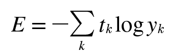

- 마찬가지로 y는 신경망 출력, t는 정답 레이블 이며 배열은 오차제곱합과 같은 형식이다.
- 교차 엔트로피 오차는 정답일 때의 출력이 전체 값을 정하게 된다.
- 정답에 해당하는 출력이 커질수록 0에 다가가다가, 출력이 1일 때 0이 된다. 반대로 정답일 때의 출력이 작아질수록 오차는 커진다.

```python
def cross_entopy_error(y,t):
  delta = 1e-7
  return -np.sum(t*np.log(y+delta))
```

- 여기서 np.log를 계산할 때 아주 작은 값인 delta를 더했다. 이는 np.log() 함수에 0을 입력하면 마이너스 무한대인 -inf가 되어 더 이상 계산을 진핼할 수 없게 되기 때문에 아주 작은 값을 더해서 절대 0이 되지 않도록 한 것이다.

### 4.2.3 미니배치 학습

- 머신러닝 문제는 훈련 데이터에 대한 손실 함수의 값을 구하고 그 값을 최대한 줄여주는 매개변수를 찾아낸다. 모든 훈련 데이터를 대상으로 손실 함수 값을 구해야 한다.
- 훈련 데이터 모두에 대한 손실 함수의 합을 구하는 방법은 아래와 같다.
  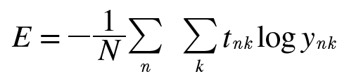

- 이때 데이터가 N개라면 tnk는 n번째 데이터의 k번째 값을 의미한다.
- 마지막에 N으로 나누어 정규화하고 있으며 N으로 나눔으로써 '평균 손실 함수'를 구하는 것이다. 이렇게 평균을 구해 사용하면 훈련 데이터 개수와 관계없이 언제든 통일된 지표를 얻을 수 있다.

- 신경망 학습에서 많은 데이터의 일부를 추려 전체의 '근사치'로 이용할 수 있는데 이 일부를 '미니배치'라고 한다.
- 가령 6만장의 훈련 데이터 중에서 100장을 무작위로 뽑아 그 100장만 사용하여 학습하는 것으로 이런 학습 방법을 '미니배치 학습'이라고 한다.

- 훈련 데이터에서 무작위로 10장을 빼내려면 다음과 같은 함수를 사용하면 된다.

```python
train_size = x_train.shape[0]
batch_size = 10
batch_mask = np.random.choice(train_size, batch_size)
x_batch = x_train[batch_mask]
t_batch = t_train[batch_mask]
```

- np.random.choice()로는 지정한 범위의 수 중에서 무작위로 원하는 개수만 꺼낼 수 있다.

### 4.2.4 (배치용) 교차 엔트로피 오차 구현하기

- 배치 데이터를 지원하는 교차 엔트로피 오차는 이전에 구현한 교차 엔트로피 오차를 조금만 바꿔주면 된다.
- 데이터가 하나인 경우와 데이터가 배치로 묶여 입력될 경우 모두를 처리할 수 있도록 구현한다.

```python
def cross_entropy_error(y,t):
  if y.ndim == 1:
    t=t.reshape(1,t.size)
    y=y.reshape(1,t.size)

  batch_size = y.shape[0]
  return -np.sum(t*np.log(y+1e-7)) / batch_size
```

- 이 코드에서 y가 1차원이라면, 즉 데이터 하나당 교차 엔트로피 오차를 구하는 경우는 reshape 함수로 데이터의 형상을 바꾸어준다.
- 그리고 배치의 크기로 나눠 정규화하고 이미지 1장당 평균의 교차 엔트로피 오차를 구한다.

- 정답 레이블이 원-핫 인코딩이 아니라 숫자 레이블로 주어질 경우 교차 엔트로피 오차는 아래와 같이 구현한다.

```python
def cross_entropy_error(y,t):
  if y.ndim == 1:
    t=t.reshape(1,t.size)
    y=y.reshape(1,t.size)

  batch_size = y.shape[0]
  return -np.sum(t*np.log(y+1e-7)) / batch_size
```

- 이 구현에서 원-핫 인코딩일 때 t가 0인 원소는 교차 엔트로피 오차도 0이므로, 그 계산은 무시해도 좋다는 것이다.

### 4.2.5 왜 손실 함수를 설정하는가?

- 궁극적인 목적은 '정확도'를 끌어내는 매개변수 값을 찾는 것인데 왜 '정확도'라는 지표를 놔두고 '손실 함수의 값'이라는 우회적인 방법을 택하는 것일까?
  - Q : 여기서 우회적인 방법이라는 정확한 의미는? 처음에는 손실 함수가 신경망 성능의 나쁨 지표를 나타내는 것이라서 정확도와는 반대의 개념이기 때문에 우회적이라고 한 것일까? 라고 생각했다.
    - 하지만 정확도를 높여야 한다는 맥락에서 보았을 때, 정확도는 정답을 맞추었느냐만 보기 때문에 미세하게 변화한 예측 확률을 알아낼 수 없다. 그래서 그것을 직접 최적화할 수 없어서 손실 함수를 대신 최적화하는 것을 '우회적'이라고 표현한 것이다.

- 이 의문은 신경망 학습에서의 '미분'의 역할에 주목한다면 해결된다.
  - 신경망 학습에서는 최적의 매개변수를 탐색할 때 손실 함수의 값을 가능한 한 작게 하는 매개변수 값을 찾는다. 이때 매개변수의 미분을 계산하고 그 값을 단서로 매개변수 값을 서서히 갱신하는 과정을 반복한다.

- 매개변수의 손실함수의 미분이란
  - '가중치 매개변수의 값을 아주 조금 변화시켰을 때, 손실 함수에서 어떻게 변하나'라는 의미
  - 미분 값이 양수이면 가중치의 매개변수를 음의 방향으로 변화시켜 손실 함수의 값을 줄일 수 있고, 미분 값이 음수이면 가중치 매개변수를 양의 방향으로 변화시켜 손실 함수의 값을 줄일 수 있다.
  - 그러나 미분 값이 0이면 가중치 매개변수를 어느 쪽으로 움직여도 손실 함수의 값은 줄어들지 않고, 매개변수의 갱신은 거기서 멈추게 된다.
- 정확도를 지표로 삼아서는 안 되는 이유는 미분 값이 대부분의 장소에서 0이 되어 매개변수를 갱신할 수 없기 때문이다.

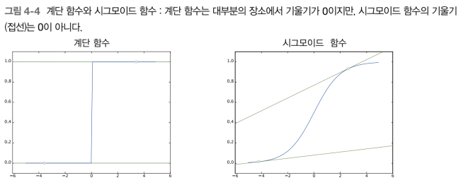

- 정확도는 매개변수의 미소한 변화에는 거의 반응을 보이지 않고, 반응이 있더라도 그 값이 불연속적으로 갑자기 변화한다.
  - 이는 계단 함수를 활성화 함수로 사용하지 않는 이유와도 연결된다.
    - 계단 함수의 미분은 대부분의 장소에서 0이다.
    - 그 결과 계단 함수를 이용하면 손실 함수를 지표로 삼는 게 아무 의미가 없어진다. -> 매개변수의 작은 변화가 주는 파장을 계단 함수가 말살하여 손실 함수의 값에는 아무 변화가 일어나지 않기 때문에
  - 계단 함수는 한순간만 변화를 일으키지만 시그모이드 함수의 미분은 그래프와 같이 출력이 연속적으로 변하고 곡선의 기울기도 연속적으로 변한다.
    - 시그모이드 함수의 미분은 어느 장소라도 0이 되지는 않는다. -> 기울기가 0이 되지 않는 덕분에 신경망이 올바르게 학습할 수 있다.

## 4.3 수치 미분

### 4.3.1 미분

- 미분은 특정 순간의 변화량을 뜻한다.

- 다음은 함수를 미분하는 나쁜 구현의 예이다.

```python
def numerical_diff(f,x):
  h = 1e-50
  return (f(x+h)-f(x))/h
```

- 하지만 위 미분 계산에는 오차가 있다. 이 오차를 개선한 그래프를 그려보면 다음과 같다.
  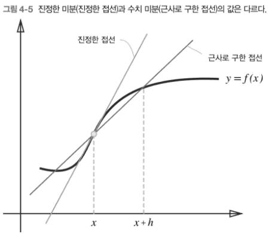

- 이 오차를 줄이기 위해 (x+h)와 (x-h)일 때의 함수 f의 차분을 계산하는 중심 차분, 중앙 차분 방식을 사용한다.

```python
def numerical_diff(f,x):
  h = 1e-4
  return (f(x+h)-f(x-h))/(2*h)
```

### 4.3.2 수치 미분의 예

- 간단한 이차함수를 미분해보면 코드는 다음과 같다.

```python
import numpy as np
import matplotlib.pylab as plt

def numerical_diff(f,x):
  h = 1e-4
  return (f(x+h)-f(x-h))/(2*h)

def function_1(x):
  return 0.01*x**2 + 0.1*x

x = np.arange(0.0,20.0,0.1)
y = function_1(x)
plt.xlabel("x")
plt.ylabel("f(x)")
plt.plot(x,y)
plt.show()
```

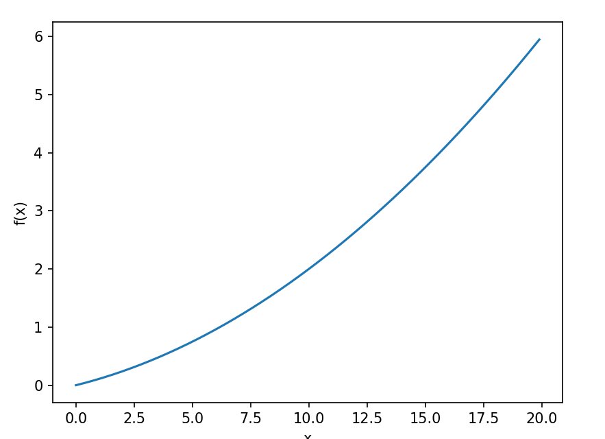

- gradient_1d.py 코드를 실행한 결과는 다음과 같다.
  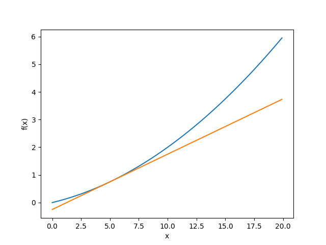

### 4.3.3 편미분

- 인수들의 제곱 합을 계산하는 식은 다음과 같다.

```python
def function_2(x:np.array):
  return x[0]**2 + x[1]**2
  # 또는 return np.sum(x**2)
```

- 여기서 주의할 점은 변수가 2개이기 때문에 어느 변수에 대한 미분이냐를 구별해야 한다는 점이다.
- 이렇게 변수가 여럿인 함수에 대한 미분을 편미분이라고 한다.
- 편미분은 변수가 하나인 미분과 마찬가지로 특정 장소의 기울기를 구한다. 단, 여러 변수 중 목표 변수 하나에 초점을 맞추고 다른 변수는 값을 고정한다.

## 4.4 기울기

- 앞 절의 예에서는 두 변수의 편미분을 따로 계산했다. 두 변수의 편미분을 동시에 계산하고 싶다면 양쪽의 편미분을 묶어서 계산한다고 생각하면 되는데 이 때 모든 변수의 편미분을 벡터로 정리한 것을 기울기라고 한다.

```python
def numerical_gradient(f,x):
  h = 1e-4
  grad = np.zeros_like(x) #x와 형상이 같은 배열 생성

  for idx in range(x.size):
    tmp_val=x[idx]

    x[idx]=tmp_val+h
    fxh1 = f(x)

    x[idx]=tmp_val-h
    fxh2 = f(x)

    grad[idx] = (fxh1-fxh2) /(2*h)
    x[idx] = tmp_val

  return grad
```

- 여기서 f는 함수이고 x는 넘파이 배열이다. 넘파이 배열 x의 각 원소에 대래서 수치 미분을 구하고 실제로 기울기를 계산할 수 있다.

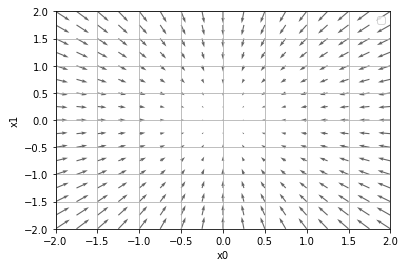

- 이 기울기가 의미하는 것이 뭘까? 시각화하면 위와 같다. 다만 여기에서는 기울기의 결과에 마이너스를 붙인 벡터를 그린 것이다.
  (여기서 마이너스를 붙이는 이유는 손실함수를 줄이는 것이 목적이기 때문에 기울기의 반대 방향으로 이동하기 위함이다.)

- 위 그림을 보면 기울기 그림은 방향을 가진 벡터로 그려진다. 기울기는 함수의 가장 낮은 장소인 최솟값을 가리키는 것 같다. 또한 가장 낮은 곳에서 멀어질 수록 화살표의 크기가 커진다.

- 기울기는 가장 낮은 장소를 가리키지만 실제로 반드시 그렇다고는 할 수 없고 각 지점에서 낮아지는 방향을 가리키는 것이다.
- "기울기가 가리키는 쪽은 각 장소에서 함수의 출력 값을 가장 크게 줄이는 방향"이다.

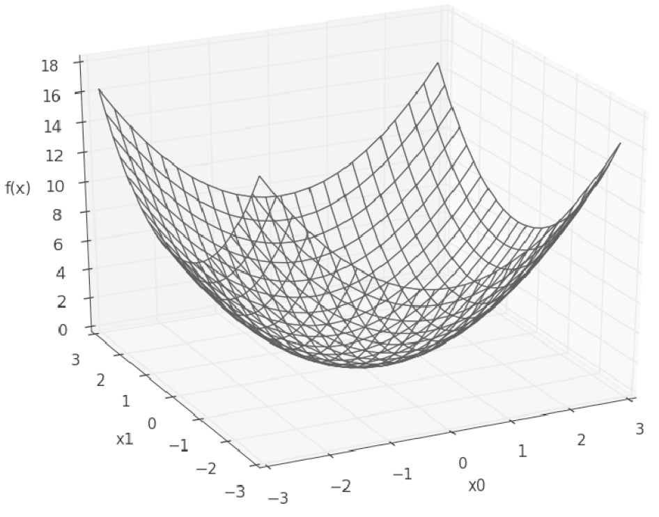

- 해당 함수의 3차원 그래프를 다시 살펴보면 화살표의 방향이 각 지점에서 함수값이 가장 빠르게 낮아지는 방향으로 향하고 있는 것을 알 수 있다.
- 화살표의 크기가 큰 것은 그 지점의 경사가 더 가파르며 조금만 움직여도 함수값이 크게 변한다는 것을 의미한다고 이해할 수 있다.

### 4.4.1 경사법(경사하강법)

- 신경망에서 최적의 매개변수(가중치와 편향)을 학습 시에 찾아야 하는데, 여기서 최적이란 손실 함수가 최솟값이 될 때의 매개변수 값이다.
- 하지만 일반적인 문제에서 매개변수 공간이 광대하여 어디가 최솟값이 되는 곳인지 짐작할 수 없다.
- 이런 상황에서 기울기를 잘 이용하여 최솟값을 찾으려는 기법이 "경사법"이다.

- 하지만 각 지점에서 함수의 값을 낮추는 방안을 제시하는 지표가 기울기인데, 그러나 기울기가 가리키는 곳에 정말 함수의 최솟값이 있는지 보장할 수 없다. 실제로 복잡한 함수에서는 기울기가 가리키는 방향에 최솟값이 없는 경우가 대부분이다.

- 경사법은 현 위치에서 기울어진 방향으로 일정 거리만큼 이동하고 이동한 곳에서도 기울기를 구하고 또 기울어진 방향으로 나아가기를 반복한다.
  - 이렇게 해서 함수의 값을 점차 줄인다.
  - 경사법은 머신러닝 모델을 최적화하는 데 흔히 쓰이는 기법으로 신경망 학습에서 많이 사용된다.

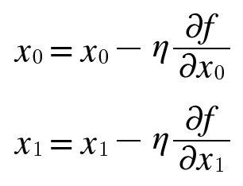

- 경사법을 수식으로 나타내면 위와 같다.

- 에타 기호는 갱신하는 양을 나타내며 신경망 학습에서는 학습률이라고 한다. 즉, 한 번의 학습으로 얼마만큼 학습해야 할지, 매개변수 값을 얼마나 갱신하느냐를 정하는 것이 학습률이다.
- 위 식과 같이 변수의 값을 갱신하는 단계를 여러 번 반복하면서 서서히 함수의 값을 줄인다. 변수의 수가 늘어도 같은 식으로 갱신한다.
- 학습률 값은 미리 특정 값으로 정해두어야 하는데 신경망 학습에서 보통 이 학습률 값을 변경하면서 올바르게 학습하고 있는지를 확인하면서 진행한다.

```python
def gradient_descent(f,init_x, lr=0.01, step_num=100):
  x = init_x

  for i in range(step_num):
    grad = numerical_gradient(f,x)
    x-= lr*grad
  return x
```

- 위의 함수는 경사하강법을 구현한 것이다.
  - 인수 f는 최적화하려는 함수, init_x는 초깃값, lr은 학습률, step_num은 경사하강법에 의한 반복 횟수를 뜻한다.
  - 기울기를 구하고 그 기울기에 학습률을 곱한 값으로 갱신하는 처리를 반복 횟수만큼 반복한다.

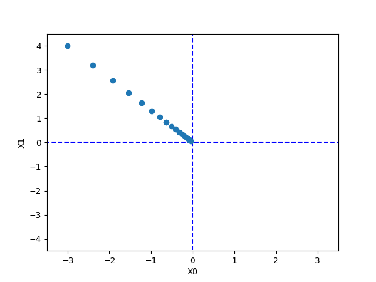

- 위의 결과는 초깃값을 (-3.0,4.0)으로 설정한 후 경사법을 사용해 최솟값 탐색을 한 것이다. 최종 결과는 (-6.1e-10,8.1e-10)으로 거의 (0,0)에 가까운 결과이다.
- 위의 그림은 경사법을 사용하여 갱신 과정을 그림으로 나타낸 것이다.

### 4.4.2 신경망에서의 기울기

- 신경망 학습에서도 기울기를 구해야 하는데 여기서의 기울기란 가중치 매개변수에 대한 손실 함수의 기울기이다.
- 가중치가 W, 손실 함수가 L인 신경망의 경우 편미분을 한다.

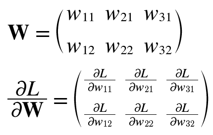

- 각 원소는 각각의 원소에 대한 편미분이고, 1행 1번째 원소는 w11을 조금 변경했을 때 손실 함수 L이 얼마나 변화하느냐를 나타낸다.

```python
import sys, os
sys.path.append(os.pardir)  # 부모 디렉터리의 파일을 가져올 수 있도록 설정
import numpy as np
from common.functions import softmax, cross_entropy_error
from common.gradient import numerical_gradient

class simpleNet:
  def __init__(self):
    self.W = np.random.randn(2,3)

  def predict(self,x):
    return np.dot(x,self.W)

  def loss(self,x,t):
    z=self.predict(x)
    y=softmax(z)
    loss = cross_entropy_error(y,t)

    return loss

```

- 위 코드는 간단한 신경망을 예로 들어 실제로 기울기를 구하는 코드이다.
  - simpleNet 클래스는 형상이 2x3인 가중치 매개변수 하나를 인스턴스 변수로 갖는다.
  - 메서드는 2개인데 하나는 예측을 수행하는 predict()이고, 다른 하나는 손실함수의 값을 구하는 loss(x,t)이다. (여기서 x는 입력데이터, t는 정답 레이블)

- 위 코드를 실행 후 이제 지금까지 처럼 numerical_gradient(f,x)를 써서 기울기를 구한다. 다만 f(W)를 정의해준다.

```python
def f(W):
  return net.loss(x,t)

dW = numerical_gradient(f,net.W)
```

- net.W를 인수로 받아 손실 함수를 계산하는 새로운 함수 f를 정의했다. 이 새로 정의한 함수를 numerical_gradient(f,x)에 넘긴다.
  - numerical_gradient()가 미분할 대상인 W를 입력받는 함수가 필요하기 때문에 f(W)를 만든 것이다. 하지만 원래 코드에서는 가중치가 이미 net.W에 저장되어 있으므로 loss()에는 입력 데이터와 정답만 전달한다.

- 이 구현에서는 새로운 함수를 정의하는 데 'def f(x):...'문법을 썼지만 파이썬에서는 간단한 함수라면 람다 기법을 쓰면 더 편하다.

```python
f= lambda w: net.loss(x,t)
dW = numerical_gradient(f,net.W)
```

- 신경망의 기울기를 구한 다음에는 경사법에 따라 가중치 매개변수를 갱신하기만 하면 된다.

## 4.5 학습 알고리즘 구현하기

- 신경망 학습의 순서
  - 전제
    - 신경망에는 적응 가능한 가중치와 편향이 있고, 이들을 훈련 데이터에 적응하도록 조정하는 과정을 '학습'이라고 한다.
  - 1단계 - 미니배치
    - 훈련 데이터 중 일부를 무작위로 가져온다. 이렇게 선별한 데이터를 미니배치라 하며, 그 미니배치의 손실 함수 값을 줄이는 것이 목표이다.
  - 2단계 - 기울기 산출
    - 미니배치의 손실 함수 값을 줄이기 위해 각 가중치 매개변수의 기울기를 구한다. 기울기는 손실 함수의 값을 가장 작게 하는 방향을 제시한다.
  - 3단계 - 매개변수 갱신
    - 가중치 매개변수를 기울기 방향으로 아주 조금 갱신한다.
  - 4단계 - 반복
    - 1~3단계를 반복

- 이는 경사 하강법으로 매개변수를 갱신하는 방법이고, 이때 데이터를 미니배치로 무작위로 선정하기 때문에 '확률적 경사 하강법'이라고 부른다.
- 대부분 딥러닝 프레임 워크는 SGD라는 함수로 이 기능을 구현한다.

### 4.5.1 2층 신경망 클래스 구현하기

- 처음에는 2층 신경망을 하나의 클래스로 구현하는 일부터 시작하며 이 클래스의 이름은 TwoLayerNet이다.

```python
import sys, os
sys.path.append(os.pardir)  # 부모 디렉터리의 파일을 가져올 수 있도록 설정
from common.functions import *
from common.gradient import numerical_gradient


class TwoLayerNet:

    def __init__(self, input_size, hidden_size, output_size, weight_init_std=0.01):
        # 가중치 초기화
        self.params = {}
        self.params['W1'] = weight_init_std * np.random.randn(input_size, hidden_size)
        self.params['b1'] = np.zeros(hidden_size)
        self.params['W2'] = weight_init_std * np.random.randn(hidden_size, output_size)
        self.params['b2'] = np.zeros(output_size)

    def predict(self, x):
        W1, W2 = self.params['W1'], self.params['W2']
        b1, b2 = self.params['b1'], self.params['b2']

        a1 = np.dot(x, W1) + b1
        z1 = sigmoid(a1)
        a2 = np.dot(z1, W2) + b2
        y = softmax(a2)

        return y

    # x : 입력 데이터, t : 정답 레이블
    def loss(self, x, t):
        y = self.predict(x)

        return cross_entropy_error(y, t)

    def accuracy(self, x, t):
        y = self.predict(x)
        y = np.argmax(y, axis=1)
        t = np.argmax(t, axis=1)

        accuracy = np.sum(y == t) / float(x.shape[0])
        return accuracy

    # x : 입력 데이터, t : 정답 레이블
    def numerical_gradient(self, x, t):
        loss_W = lambda W: self.loss(x, t)

        grads = {}
        grads['W1'] = numerical_gradient(loss_W, self.params['W1'])
        grads['b1'] = numerical_gradient(loss_W, self.params['b1'])
        grads['W2'] = numerical_gradient(loss_W, self.params['W2'])
        grads['b2'] = numerical_gradient(loss_W, self.params['b2'])

        return grads
```

- TwoLayerNet 클래스는 딕셔너리인 params와 grads를 인스턴스 변수로 갖는다.
  - params 변수 : 이 신경망에 필요한 매개변수가 모두 저장되고, params 변수에 저장된 가중치 매개변수가 예측 처리(순방향 처리)에서 사용된다.
  - grads 변수 : params 변수에 대응하는 각 매개변수의 기울기가 저장된다.

- TwoLayerNet의 메서드
  - **init** 메서드 : 클래스를 초기화한다. 인수는 순서대로 입력층의 뉴런 수, 은닉층의 뉴런 수, 출력층의 뉴런 수이다. 여기서 가중치 매개변수도 초기화 한다.
  - loss(self,x,t) 메서드 : 손실 함수의 값을 계산하는 메서드로 predict()의 결과와 정답 레이블을 바탕으로 교차 엔트로피 오차를 구하도록 구현했다.
  - numerical_gradient(self,x,t) 메서드 : 각 매개변수의 기울기를 계산한다. 수치 미분 방식
  - gradient(self,x,t) 메서드 : 다음 장에서 구현할 것으로 이 메서드는 오차역전파법을 사용하여 기울기를 효율적이고 빠르게 계산한다. 수치 미분을 사용할 때보다 같은 결과를 훨씬 빠르게 얻을 수 있다.

### 4.5.2 미니배치 학습 구현하기

- 미니배치 학습은 훈련 데이터 중 일부를 무작위로 꺼내고 그 미니배치에 대해 경사법으로 매개변수를 갱신한다.

```python
import numpy as np
from dataset.mnist import load_mnist
from two_layer_net import TwoLayerNet

(x_train, t_train), (x_test, t_test) = \
    load_mnist(normalize=True, one_hot_label=True)

train_loss_list=[]

# 하이퍼파라미터
iters_num = 10000 # 반복 횟수
train_size = x_train.shape[0]
batch_size = 100 # 미니배치 크기
learning_rate = 0.1

network = TwoLayerNet(input_size=784, hidden_size=50, output_size=10)

for i in range(iters_num):
    # 미니배치 획득
    batch_mask = np.random.choice(train_size, batch_size)
    x_batch = x_train[batch_mask]
    t_batch = t_train[batch_mask]

    # 기울기 계산
    grad = network.numerical_gradient(x_batch, t_batch)
    # grad = network.gradient(x_batch, t_batch) # 성능 개선판

    # 매개변수 갱신
    for key in ('W1','b1','W2','b2'):
        network.params[key] -= learning_rate * grad[key]

    # 학습 경과 기록
    loss = network.loss(x_batch, t_batch)
    train_loss_list.append(loss)
```

- 여기에서는 미니배치의 크기를 100으로 했다.
  - 매번 60000개의 훈련 데이터에서 임의로 100개의 데이터를 추려낸다.
  - 그리고 그 100개의 미니배치를 대상으로 확률적 경사하강법을 수행해 매개변수를 갱신한다.
- 경사법에 대한 갱신 횟수를 10000번으로 설정하고 갱신할 때마다 훈련 데이터에 대한 손실 함수를 계산하여 그 값을 배열에 추가한다.

- 손실 함수의 값이 변하는 추이 그래프
  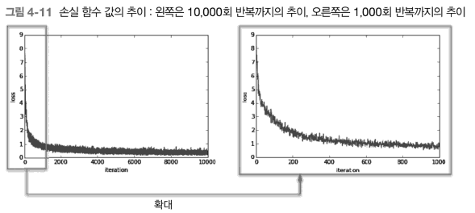

- 학습 횟수가 늘어가면서 손실 함수의 값이 줄어든다.
  - 학습이 잘 되고 있다는 뜻으로, 신경망의 가중치 매개변수가 서서히 데이터에 적응하고 있음을 의미
  - 데이터 반복학습을 통해 최적 가중치 매개변수로 서서히 다가서는 것.

### 4.5.3 시험 데이터로 평가하기

- 학습을 반복함으로써 손실 함수의 값이 서서히 내려가는데, 이때의 손실 함수의 값이란 '훈련 데이터의 미니배치에 대한 손실 함수'의 값이다.
  - 손실 함수 값이 작아지는 것은 신경망이 잘 학습하고 있다는 방증이긴 하지만 이 결과만으로는 다른 데이터셋에도 비슷한 실력을 발휘하는 지는 알 수 없다.

- 신경망 학습에서는 훈련 데이터 외의 데이터를 올바르게 인식하는지를 확인해야 한다. 즉, '과대적합'을 일으키지 않는지 확인해야 한다.
  - 과대적합되었다는 것은 훈련 데이터에 포함된 이미지만 제대로 구분하고, 그렇지 않은 이미지는 식별할 수 없다는 뜻이다.

- 신경망 학습의 목표는 범용적인 능력을 익히는 것으로 범용 능력을 평가하려면 훈련 데이터에 포함되지 않은 데이터를 사용해 평가해 봐야 한다.
  - 다음 구현에서는 학습 도중 정기적으로 훈련 데이터와 시험 데이터를 대상으로 정확도를 기록한다. (1에포크별로)
    - 에포크는 하나의 단위이다. 1에포크는 학습에서 훈련 데이터를 모두 소진했을 때의 횟수에 해당한다.

```python
import sys, os
sys.path.append(os.pardir)  # 부모 디렉터리의 파일을 가져올 수 있도록 설정
import numpy as np
import matplotlib.pyplot as plt
from dataset.mnist import load_mnist
from two_layer_net import TwoLayerNet

# 데이터 읽기
(x_train, t_train), (x_test, t_test) = load_mnist(normalize=True, one_hot_label=True)

network = TwoLayerNet(input_size=784, hidden_size=50, output_size=10)

# 하이퍼파라미터
iters_num = 10000  # 반복 횟수를 적절히 설정한다.
train_size = x_train.shape[0]
batch_size = 100   # 미니배치 크기
learning_rate = 0.1

train_loss_list = []
train_acc_list = []
test_acc_list = []

# 1에폭당 반복 수
iter_per_epoch = max(train_size / batch_size, 1)

for i in range(iters_num):
    # 미니배치 획득
    batch_mask = np.random.choice(train_size, batch_size)
    x_batch = x_train[batch_mask]
    t_batch = t_train[batch_mask]

    # 기울기 계산
    #grad = network.numerical_gradient(x_batch, t_batch)
    grad = network.gradient(x_batch, t_batch)

    # 매개변수 갱신
    for key in ('W1', 'b1', 'W2', 'b2'):
        network.params[key] -= learning_rate * grad[key]

    # 학습 경과 기록
    loss = network.loss(x_batch, t_batch)
    train_loss_list.append(loss)

    # 1에폭당 정확도 계산
    if i % iter_per_epoch == 0:
        train_acc = network.accuracy(x_train, t_train)
        test_acc = network.accuracy(x_test, t_test)
        train_acc_list.append(train_acc)
        test_acc_list.append(test_acc)
        print("train acc, test acc | " + str(train_acc) + ", " + str(test_acc))

# 그래프 그리기
markers = {'train': 'o', 'test': 's'}
x = np.arange(len(train_acc_list))
plt.plot(x, train_acc_list, label='train acc')
plt.plot(x, test_acc_list, label='test acc', linestyle='--')
plt.xlabel("epochs")
plt.ylabel("accuracy")
plt.ylim(0, 1.0)
plt.legend(loc='lower right')
plt.show()
```

- 이 예에서는 1에포크마다 모든 훈련 데이터와 시험 데이터에 대한 정확도를 계산하고, 그 결과를 기록한다.
  - 1에포크마다 계산하는 이유는 for문 안에서 매번 계산하기에는 시간이 오래 걸리고, 또 그렇게 자주 기록할 필요도 없기 때문이다.
  - 더 큰 관점에서 추이만 알 수 있으면 된다.

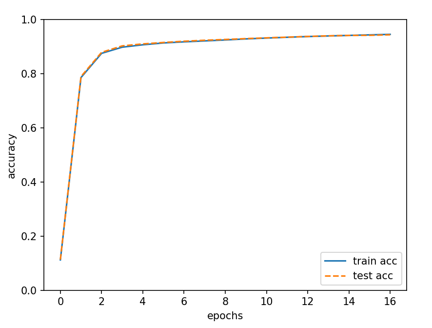

- 위 그림에서 훈련 데이터에 대한 정확도는 실선, 시험 데이터에 대한 정확도는 점선이다.
  - 에포크가 진행될수록 두가지 데이터를 사용하고 평가한 정확도가 모두 좋아진다.
  - 이번 학습에서는 두 정확도의 차이가 거의 없으므로 과대적합이 일어나지 않았다는 것을 알 수 있다.

## 4.6 정리

- 신경망 학습에 대해 설명했다.
  - 신경망이 학습을 수행할 수 있도록 손실 함수라는 지표를 도입했다.
  - 이 손실 함수를 기준으로 그 값이 가장 작아지는 가중치 매개변수 값을 찾아내는 것이 신경망 학습의 목표이다.
  - 가능한 한 작은 손실 함수의 값을 찾는 수법으로 경사법을 소개했다.(함수의 기울기를 이용하는 방법)
