## 개요

- 앞 장에서 신경망의 가중치 매개변수의 기울기를 수치 미분을 사용해 구했다. 수치 미분은 단순하고 구현하기도 쉽지만 계산이 오래걸린다. 이번 장에서는 가중치 매개변수의 기울기를 효율적으로 구하는 '오차역전파법'을 배운다.

- 오차역전파법을 제대로 이해하는 방법에는 수식을 통한 방법, 계산 그래프를 통한 방법이 있다. 보통 전자 쪽이 일반적인 방법이지만 이번 장에서는 계산 그래프를 사용해서 '시각적'으로 이해하도록 설명한다.

## 5.1 계산그래프

- 계산 그래프는 계산 과정을 표현한 그래프로 복수의 노드와 에지로 표현된다.

### 5.1.1 계산 그래프로 풀다.

- 계산 그래프는 계산 과정을 노드와 화살표로 표현하는데 노드는 원으로 표기하고 원 안에 연산 내용을 적는다.
  - 곱셈만을 연산으로 생각할 수도 있기 때문에 곱하는 숫자를 원 밖에 표기할 수도 있다.


- 계산 그래프를 이용한 문제풀이는 다음과 같은 흐름으로 진행된다.
  - 1. 계산 그래프를 구성한다.
  - 2. 그래프에서 계산을 왼쪽에서 오른쪽으로 진행한다.

- 여기서 계산을 왼쪽에서 오른쪽으로 진행하는 것을 순전파, 오른쪽에서 왼쪽으로 진행하는 것을 역전파라고 하는데 이는 미분을 계산할 때 중요한 역할을 한다.

### 5.1.2 국소적 계산

- 계산 그래프는 '국소적 계산'을 전파함으로써 최종 결과를 얻는다.
  - 국소적이란 '자신과 직접 관계된 작은 범위'라는 뜻으로 국소적 계산은 결국 전체에서 어떤 일이 벌어지든 상관없이 자신과 관계된 정보만으로 결과를 출력한다.


- 위의 그래프에서는 복잡한 계산을 거쳐 여러 식품을 계산한 후 사과의 계산값을 더한다.
  - 여기서 계산은 '국소적' 계산이기 때문에 이전의 복잡한 계산이 어떻게 계산되었느냐를 상관할 필요 없이 자신과 관련한 계산만 신경쓰면 된다.
  - 이처럼 계산 그래프는 국소적 계산에 집중하기 때문에 단순하지만 그 결과를 전달함으로써 전체를 구성하는 복잡한 계산을 해낼 수 있다.

### 5.1.3 왜 계산 그래프로 푸는가?

- 계산 그래프의 이점은 '국소적 계산'이다. 또한 중간 계산 결과를 모두 보관할 수 있다는 장점이 있다.
- 또한 실제 계산 그래프를 사용하는 가장 큰 이유는 역전파를 통해 '미분'을 효율적으로 계산할 수 있다는 점에 있다.


- 여기서는 '사과 가격에 대한 지불 금액의 미분'같으 값을 역전파를 통해 구할 수 있다.
  - 사과가 1원 오르면 최종 금액은 2.2원 오른다는 뜻이다.

- 소비세에 대한 지불 금액의 미분이나 사과 개수에 대한 지불 금액의 미분도 같은 순서로 구할 수 있으며 중간까지 구한 미분 결과를 공유할 수 있어서 효율적이다.

## 5.2 연쇄법칙

- 역전파는 '국소적인 미분'을 순방향과는 반대로 전달하는데 이 원리는 '연쇄법칙'에 따른 것이다.

### 5.2.1 계산 그래프의 역전파


- 위 그림과 같이 신호 E에 노드의 국소적 미분을 곱한 후 다음 노드로 전달하여 역전파를 계산한다.
  - 여기서 말하는 국소적 미분은 순전파 때의 함수의 계산의 미분을 구한다는 뜻이며 이는 x에 대한 y의 미분이다.
  - 그리고 이 국소적인 미분을 상류에서 전달된 값에 곱해 앞쪽 노드로 전달하는 것이다.

### 5.2.2 연쇄법칙이란?

- 연쇄법칙을 설명하려면 합성 함수부터 시작한다.
  - 합성 함수란 여러 함수로 구성된 함수

- 합성 함수의 미분은 합성 함수를 구성하는 각 함수의 미분의 곱으로 나타낼 수 있다.
  - 예를 들어 x에 대한 z의 미분은 t에 대한 z의 미분과 x에 대한 t의 미분의 곱으로 나타낼 수 있는 것이다.

### 5.2.3 연쇄법칙과 계산 그래프


- 계산 그래프에 연쇄법칙을 적용한 것이다.
  - 국소적 미분을 하면 역전파에서 각 노드에서 바로 앞뒤 관계만 미분하게 된다.
  - 역전파를 진행하면 이것들을 계속 곱하게 되는데 그 결과 최종 출력을 처음 변수에 대해 미분한 값을 얻게 되는 것이다.
  - 결국에는 여러 국소적 미분을 연쇄법칙으로 연결해서 전체 미분값을 얻을 수 있다.

## 5.3 역전파

- 이번 절에서는 '+'와 'x'등의 연산을 예로 들어 역전파의 구조를 설명한다.

### 5.3.1 덧셈 노드의 역전파

- z=x+y라는 식을 대상으로 역전파를 살펴보자. - x에 대한 z의 미분, y에 대한 z의 미분 모두 1이 된다.
  
- 위와 같이 역전파는 상류에서 전해진 미분에 1을 곱하여 그대로 하류로 흘린다. 즉 덧셈 노드의 역전파는 입력된 값을 그대로 다음 노드로 전달한다.
  - 여기서 최종적으로 L이라는 값을 출력하는 큰 계산 그래프를 가정하기 때문에 z에 대한 L의 미분값을 전달한 것이다.

### 5.3.2 곱셈 노드의 역전파

- z=xy라는 식을 생각해 보자. - x에 대한 z의 미분은 y, y에 대한 z의 미분은 x이다.
  

- 곱셈 노드 역전파는 상류의 값에 순전파 때의 입력신호들을 '서로 바꾼 값'을 곱해서 하류로 보낸다.
  - 덧셈의 역전파와는 달리 곱셈의 역전파는 순방향 입력 신호의 값이 필요하다.
  - 따라서 곱셈 노드를 구현할 때는 순전파의 입력 신호를 변수에 저장해 둔다.

### 5.3.3 사과 쇼핑의 예


- 이 문제에서는 사과의 가격, 사과의 개수, 소비세라는 세 변수 각각이 최종 금액에 어떻게 영향을 주느냐를 풀었다.
- 다만 이 예에서 사과 가격과 소비세의 단위가 다르므로 주의

## 5.4 단순한 계층 구현하기

- 이번 절에서는 사과 쇼핑의 예를 파이썬으로 구현하는데, 곱셈노드는 MulLayer클래스, 덧셈 노드는 AddLayer클래스이다.

### 5.4.1 곱셈 계층

- 모든 계층은 forward() 순전파, backward() 역전파 공통 메서드를 갖도록 구현한다.

```python
class MulLayer:
    def __init__(self):
        self.x=None
        self.y=None
    def forward(self,x,y):
        self.x=x
        self.y=y
        out = x*y

        return out

    def backward(self,dout):
        dx=dout*self.y
        dy=dout*self.x

        return dx,dy
```

- 구현한 코드는 buy_apple.py에 있다.
- 여기서 왜 MulLayer()라는 클래스를 각각 다른 객체로 만들어서 사용할까?
  - 그 이유는 각 곱셈 노드가 본인의 입력값을 따로 기억해야 하기 때문이다.
  - forward() 순전파에서 입력값을 객체 내부에 저장하는데, 각 객체가 기억하는 값이 다르다.
  - 역전파에서는 이 저장된 값들을 이용해서 미분하는 것이다!
    - 만약 역전파가 필요 없다면 각각의 객체를 만들 필요는 없다.

### 5.4.2 덧셈 계층

```python
class AddLayer:
    def __init__(self):
        pass

    def forward(self,x,y):
        out=x+y
        return out

    def backward(self,dout):
        dx=dout*1
        dy=dout*1
        return dx,dy
```

- 구현한 코드는 buy_apple_orange.py에 있다.

## 5.5 활성화 함수 계층 구현하기

- 이제 계산 그래프를 신경망에 구현하는데, 여기에서는 신경망을 구성하는 층 각각을 클래스 하나로 구현한다.
- 우선 활성화 함수인 ReLU와 Sigmoid 계층을 구현한다.

### 5.5.1 ReLU 계층

- ReLU 수식에서 순전파 때의 입력인 x가 0보다 크면 역전파는 상류의 값을 그대로 하류로 흘리지만 순전파 때 x가 0이면 역전파 때는 하류로 신로를 보내지 않는다.(0을 보냄)

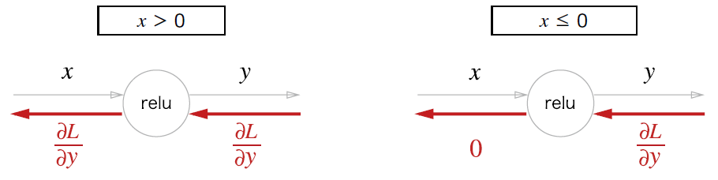

```python
class Relu:
  def __init__(self):
    self.mask = None

  def forward(self,x):
    self.mask = (x<=0)
    out = x.copy()
    out[self.mask]=0

    return out

  def backward(self,dout):
    dout[self.mask]=0
    dx=dout

    return dx
```

- ReLU 클래스는 mask라는 인스턴스 변수를 갖는다.
  - 이는 True/False로 구성된 넘파이 배열으로, 순전파 입력이 0이하인 인덱스는 True, 그 외는 False로 유지
    - 그러니까 이 self.mask에는 넘파이 배열이 들어간다. 그래서 out[self.mask]=0 이라는 것의 뜻은 self.mask가 True인 위치의 값을 0으로 바꾼다는 뜻.
  - 그래서 순전파 때 만들어둔 mask가 True이면 역전파때 이걸 사용해서 dout을 0으로 만드는 것
    - dout은 out과 별개의 배열이지만(그래서 완전히 값이 다르고 또 순전파때와 달리 양수 값이더라도) out으로 만들어진 self.mask를 역전파에 다시 써서 그대로 적용하는 것이다.

### 5.5.2 Sigmoid 계층

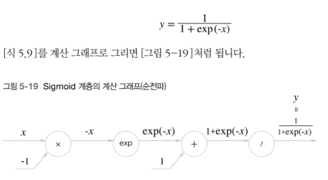

- 시그모이드 함수의 계산그래프는 위와 같다.
- exp노드는 y=exp(x) 계산을 수행하고, / 노드는 y=1/x 계산을 수행한다.

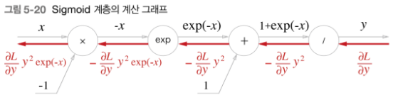

- 시그모이드 역전파의 흐름
  - /를 미분하면 -y^2 이 된다. 이를 상류에서 흘러온 값에 곱해서 하류로 전한다.
  - +는 그대로 전달
  - exp연산의 미분은 exp(x)이므로 이를 곱해서 전달한다. 여기서는 exp(-x)
  - x노드는 순전파 때의 값을 서로 바꿔서 곱하므로 여기에서는 -1을 곱한다.

- 간소화하면 다음과 같다.
  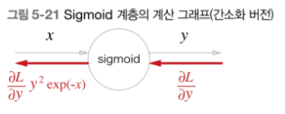

- 위와 같이 사용하면 세세한 계산 없이 간단하게 입력과 출력에만 집중할 수 있다. 그리고 입력과 출력만으로 계산할 수 있다는 사실을 알 수 있다.
- 하지만 식을 더 간소화할 수 있다.
  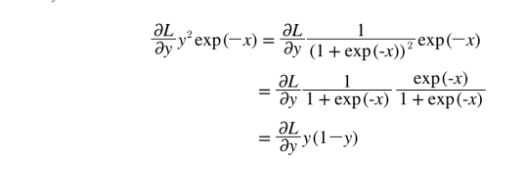
- 위와 같이 시그모이드 계층의 역전파는 순전파의 출력만으로 계산할 수 있다.

```python
class Sigmoid:
  def __init__(self):
    self.out = None

  def forward(self,x):
    out = sigmoid(x) #순전파 때의 출력을 out에 보관한 후 역전파 계산 때 그 값을 사용
    self.out = out
    return out

    def backward(self,dout):
      dx=dout*(1.0-self.out)*self.out
      return dx

```

## 5.6 Affine/Softmax 계층 구현하기

### 5.6.1 Affine 계층

- Affine 계층의 계산 그래프에서는 스칼라 대신 행렬이 흐른다.
  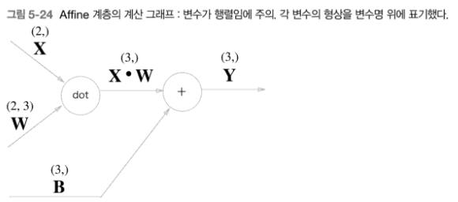

- Affine 계층의 역전파를 계산 그래프로 나타내면 다음과 같다.
  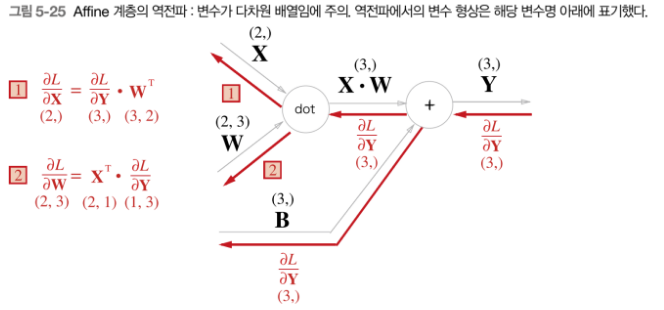

- X와 X를 미분한것, W와 W를 미분한 것은 같은 형상임에 주의하자.

### 5.6.2 배치용 Affine 계층

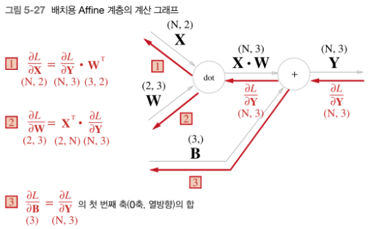

- 데이터 N개를 묶어 순전파 하는 경우(배치용 Affine 계층)
- 기존과 다른 부분은 입력인 X의 형상이 (N,2)가 된 것이다.
  - 역전파 때는 행렬의 형상에 주의하면 이전과 같이 도출할 수 있다.

- 편향을 더할 때에도 주의해야 하는데 순전파 때의 편향 덧셈음 각 데이터(N개의 데이터에 각각) 더해진다.
  - 예를 들어 N=2일때 이런식으로 두 데이터 각각의 계산 결과에 더해진다.

  ```python
  import numpy as np

  X_dot_W = np.array([[0,0,0], [10,10,10]])
  B = np.array([1,2,3])

  print(X_dot_W)
  print(X_dot_W + B)

  >>>
  [[ 0  0  0]
   [10 10 10]]
  [[ 1  2  3]
   [11 12 13]]
  ```

  - 역전파 때는 각 데이터의 역전파 값이 편향의 원소에 모여야 한다.

  ```python
  dY = np.array([[1,2,3],[4,5,6]])
  print(dY)
  dB = np.sum(dY, axis=0)
  print(dB)

  >>>
  [[1 2 3]
   [4 5 6]]
  [5 7 9]
  ```

  - 순전파에서 편향은 각각의 데이터에 들어가게 되며 이는 '하나의 편향'을 모든 데이터가 공유하는 것이라고 할 수 있다.
  - 그래서 역전파할 때는 편향이 손실함수에 미친 전체 영향을 구하려면 데이터 개수에 해당하는 만큼의 경로에서 오는 기울기를 합쳐야 한다.
    - 그리고 axis=0은 세로로 더하는 것

```python
class Affine:
  def __init__(self,W,b):
    self.W=W
    self.b=b
    self.x=None
    #가중치 편향과 매개변수의 미분
    self.dW=None
    self.db=None

  def forward(self,x):
    self.x=x
    out=np.dot(x,self.W)+self.b
    return out

  def backward(self,dout):
    dx=np.dot(dout,self.W.T) #넘파이 배열의 전치속성 T
    self.dW=np.dot(self.x.T,dout)
    self.db=np.sum(dout,axis=0)
    return dx

```

### 5.6.3 Softmax-with-Loss 계층

- 소프트맥스 함수는 입력 값을 정규화(출력의 합이 1이 되도록 변형)하려 출력한다. 손글씨 숫자 인식에서의 Softmax 계층의 출력은 다음과 같고, 손글씨 숫자가 10개니까 입력도 10개가 된다.

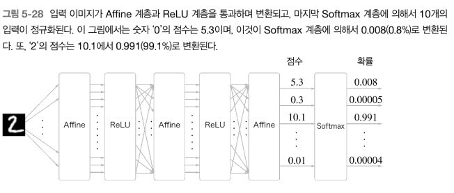

- 신경망에서는 학습과 추론을 둘 다 하는데
  - 추론할 때는 가장 높은 점수만 알면 되기 때문에 소프트맥스 함수를 거치기 전(정규화 되지 않은 상태)의 점수만 알아도 되고,
  - 다만 신경망을 학습할 때에는 소프트맥스 함수가 필요하다.

- Softmax-with-Loss 계층의 계산 그래프
  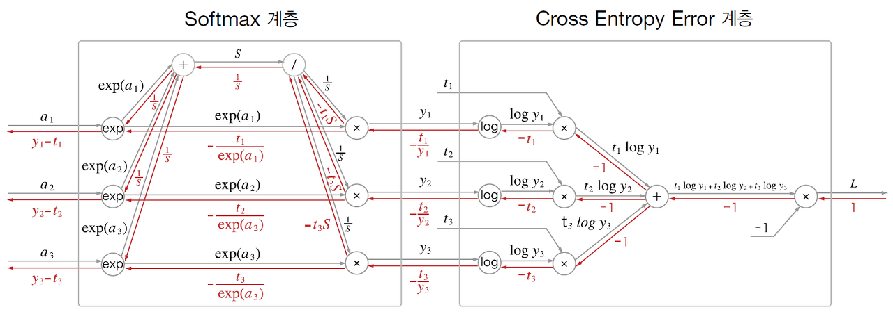

- 간소화하면 다음과 같다.
  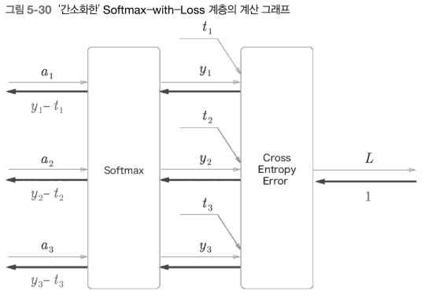

- Softmax 계층
  - 입력(a1,a2,a3)을 정규화하여 (y1,y2,y3)를 출력한다.
- Cross Entropy Error 계층
  - Softmax의 출력과 정답레이블을 받고 이 데이터로 부터 손실 L을 출력(출력과 정답의 차분)
  - 역전파에서는 이 오차가 앞 계층에 전해지게 된다.

```python
class SoftmaxWithLoss:
  def __init__(self):
    self.loss=None
    self.y=None
    self.t=None

  def forward(self,x,t):
    self.t=t
    self.y=softmax(x)
    self.loss=crosss_entropy_error(self.y,self.t)

    return self.loss

  def backward(self,dout=1):
    batch_size=self.t.shape[0]
    if self.t.size==self.y.size:
      dx= (self.y-self.t)/batch_size
    else:
      dx=self.y.copy()
      dx[np.arange(batch_size),self.t]-=1
      dx=dx/batch_size

    return dx
```

- 역전파 때는 전파하는 값을 배치의 수로 나눠서 데이터 1개당 오차를 앞 계층으로 전파한다.
