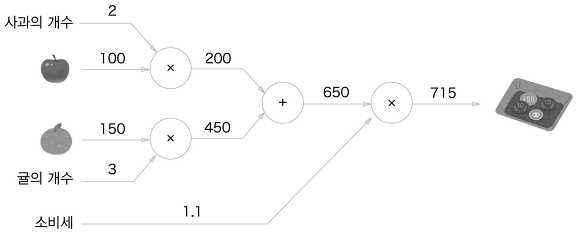
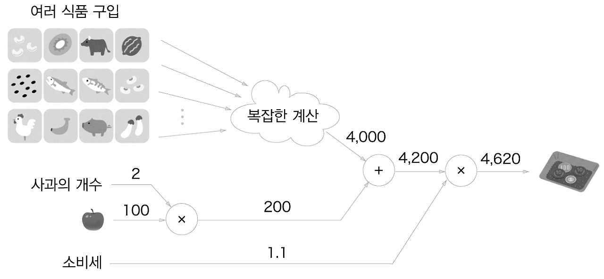
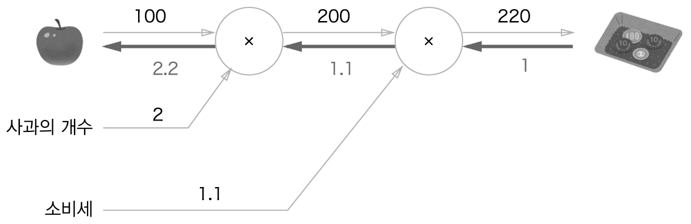
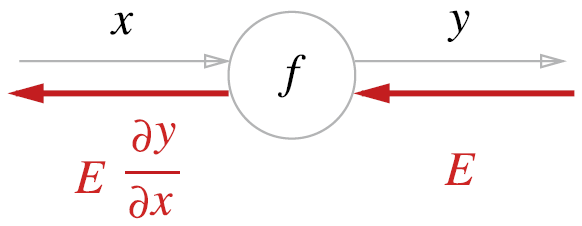
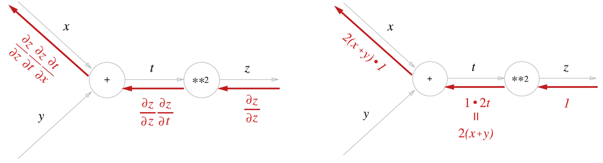
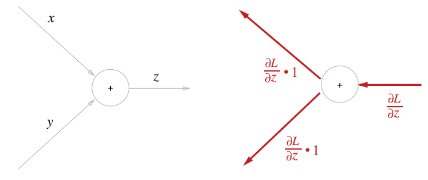
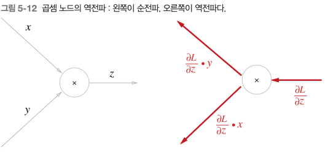
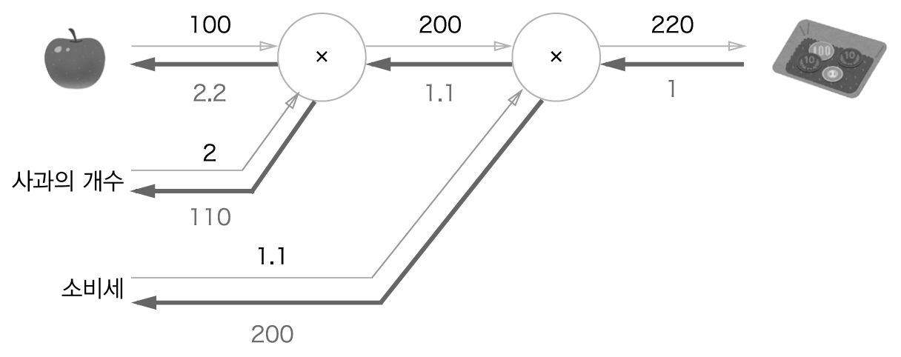

## 개요

- 앞 장에서 신경망의 가중치 매개변수의 기울기를 수치 미분을 사용해 구했다. 수치 미분은 단순하고 구현하기도 쉽지만 계산이 오래걸린다. 이번 장에서는 가중치 매개변수의 기울기를 효율적으로 구하는 '오차역전파법'을 배운다.

- 오차역전파법을 제대로 이해하는 방법에는 수식을 통한 방법, 계산 그래프를 통한 방법이 있다. 보통 전자 쪽이 일반적인 방법이지만 이번 장에서는 계산 그래프를 사용해서 '시각적'으로 이해하도록 설명한다.

## 5.1 계산그래프

- 계산 그래프는 계산 과정을 표현한 그래프로 복수의 노드와 에지로 표현된다.

### 5.1.1 계산 그래프로 풀다.

- 계산 그래프는 계산 과정을 노드와 화살표로 표현하는데 노드는 원으로 표기하고 원 안에 연산 내용을 적는다.
  - 곱셈만을 연산으로 생각할 수도 있기 때문에 곱하는 숫자를 원 밖에 표기할 수도 있다.



- 계산 그래프를 이용한 문제풀이는 다음과 같은 흐름으로 진행된다.
  - 1. 계산 그래프를 구성한다.
  - 2. 그래프에서 계산을 왼쪽에서 오른쪽으로 진행한다.

- 여기서 계산을 왼쪽에서 오른쪽으로 진행하는 것을 순전파, 오른쪽에서 왼쪽으로 진행하는 것을 역전파라고 하는데 이는 미분을 계산할 때 중요한 역할을 한다.

### 5.1.2 국소적 계산

- 계산 그래프는 '국소적 계산'을 전파함으로써 최종 결과를 얻는다.
  - 국소적이란 '자신과 직접 관계된 작은 범위'라는 뜻으로 국소적 계산은 결국 전체에서 어떤 일이 벌어지든 상관없이 자신과 관계된 정보만으로 결과를 출력한다.



- 위의 그래프에서는 복잡한 계산을 거쳐 여러 식품을 계산한 후 사과의 계산값을 더한다.
  - 여기서 계산은 '국소적' 계산이기 때문에 이전의 복잡한 계산이 어떻게 계산되었느냐를 상관할 필요 없이 자신과 관련한 계산만 신경쓰면 된다.
  - 이처럼 계산 그래프는 국소적 계산에 집중하기 때문에 단순하지만 그 결과를 전달함으로써 전체를 구성하는 복잡한 계산을 해낼 수 있다.

### 5.1.3 왜 계산 그래프로 푸는가?

- 계산 그래프의 이점은 '국소적 계산'이다. 또한 중간 계산 결과를 모두 보관할 수 있다는 장점이 있다.
- 또한 실제 계산 그래프를 사용하는 가장 큰 이유는 역전파를 통해 '미분'을 효율적으로 계산할 수 있다는 점에 있다.



- 여기서는 '사과 가격에 대한 지불 금액의 미분'같으 값을 역전파를 통해 구할 수 있다.
  - 사과가 1원 오르면 최종 금액은 2.2원 오른다는 뜻이다.

- 소비세에 대한 지불 금액의 미분이나 사과 개수에 대한 지불 금액의 미분도 같은 순서로 구할 수 있으며 중간까지 구한 미분 결과를 공유할 수 있어서 효율적이다.

## 5.2 연쇄법칙

- 역전파는 '국소적인 미분'을 순방향과는 반대로 전달하는데 이 원리는 '연쇄법칙'에 따른 것이다.

### 5.2.1 계산 그래프의 역전파



- 위 그림과 같이 신호 E에 노드의 국소적 미분을 곱한 후 다음 노드로 전달하여 역전파를 계산한다.
  - 여기서 말하는 국소적 미분은 순전파 때의 함수의 계산의 미분을 구한다는 뜻이며 이는 x에 대한 y의 미분이다.
  - 그리고 이 국소적인 미분을 상류에서 전달된 값에 곱해 앞쪽 노드로 전달하는 것이다.

### 5.2.2 연쇄법칙이란?

- 연쇄법칙을 설명하려면 합성 함수부터 시작한다.
  - 합성 함수란 여러 함수로 구성된 함수

- 합성 함수의 미분은 합성 함수를 구성하는 각 함수의 미분의 곱으로 나타낼 수 있다.
  - 예를 들어 x에 대한 z의 미분은 t에 대한 z의 미분과 x에 대한 t의 미분의 곱으로 나타낼 수 있는 것이다.

### 5.2.3 연쇄법칙과 계산 그래프



- 계산 그래프에 연쇄법칙을 적용한 것이다.
  - 국소적 미분을 하면 역전파에서 각 노드에서 바로 앞뒤 관계만 미분하게 된다.
  - 역전파를 진행하면 이것들을 계속 곱하게 되는데 그 결과 최종 출력을 처음 변수에 대해 미분한 값을 얻게 되는 것이다.
  - 결국에는 여러 국소적 미분을 연쇄법칙으로 연결해서 전체 미분값을 얻을 수 있다.

## 5.3 역전파

- 이번 절에서는 '+'와 'x'등의 연산을 예로 들어 역전파의 구조를 설명한다.

### 5.3.1 덧셈 노드의 역전파

- z=x+y라는 식을 대상으로 역전파를 살펴보자. - x에 대한 z의 미분, y에 대한 z의 미분 모두 1이 된다.
  
- 위와 같이 역전파는 상류에서 전해진 미분에 1을 곱하여 그대로 하류로 흘린다. 즉 덧셈 노드의 역전파는 입력된 값을 그대로 다음 노드로 전달한다.
  - 여기서 최종적으로 L이라는 값을 출력하는 큰 계산 그래프를 가정하기 때문에 z에 대한 L의 미분값을 전달한 것이다.

### 5.3.2 곱셈 노드의 역전파

- z=xy라는 식을 생각해 보자. - x에 대한 z의 미분은 y, y에 대한 z의 미분은 x이다.
  

- 곱셈 노드 역전파는 상류의 값에 순전파 때의 입력신호들을 '서로 바꾼 값'을 곱해서 하류로 보낸다.
  - 덧셈의 역전파와는 달리 곱셈의 역전파는 순방향 입력 신호의 값이 필요하다.
  - 따라서 곱셈 노드를 구현할 때는 순전파의 입력 신호를 변수에 저장해 둔다.

### 5.3.3 사과 쇼핑의 예



- 이 문제에서는 사과의 가격, 사과의 개수, 소비세라는 세 변수 각각이 최종 금액에 어떻게 영향을 주느냐를 풀었다.
- 다만 이 예에서 사과 가격과 소비세의 단위가 다르므로 주의

## 5.4 단순한 계층 구현하기

- 이번 절에서는 사과 쇼핑의 예를 파이썬으로 구현하는데, 곱셈노드는 MulLayer클래스, 덧셈 노드는 AddLayer클래스이다.

### 5.4.1 곱셈 계층

- 모든 계층은 forward() 순전파, backward() 역전파 공통 메서드를 갖도록 구현한다.

```python
class MulLayer:
    def __init__(self):
        self.x=None
        self.y=None
    def forward(self,x,y):
        self.x=x
        self.y=y
        out = x*y

        return out

    def backward(self,dout):
        dx=dout*self.y
        dy=dout*self.x

        return dx,dy
```

### 5.4.2 덧셈 계층

```python
class AddLayer:
    def __init__(self):
        pass

    def forward(self,x,y):
        out=x+y
        return out

    def backward(self,dout):
        dx=dout*1
        dy=dout*1
        return dx,dy
```
